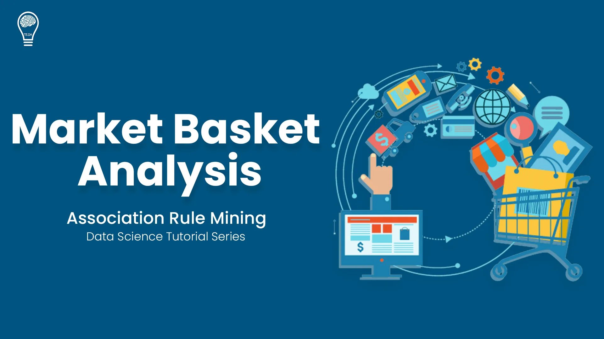

  

## Overview
This data study employed a standard market basket analysis. It emphasized how market basket research can boost grocery sales when correctly interpreted and used, resulting in a better customer experience and more revenue for the company. Hence, as a result, it will increase consumer contentment. Depending on the clients' views, the MBA technique provides for informed choices while offering services. However, loyalty programs lack this skill, especially when dealing with clients who express ambiguous emotions. These judgments are based on how prior, comparable shop visitors used the services.

I developed a model aimed at predicting profit for each of the segement of the superstore.

## About the data:
An anonymous sample of more than 3 million grocery orders from more than 200,000 Instacart users makes up the dataset. It shows anywhere from 4 to 100 orders for each user, together with the things bought in each order and what order. This study aims to create an application that analyzes client purchasing patterns using Apriori algorithms and then recommends relevant products to users. 

## Conclusion
The study of the transactional data set revealed that association rules were crucial in tying together the products that are likely to be bought simultaneously and linking them to a rise in cost prices. By utilizing this data, eBay will better understand consumer behaviour. Conversion and revenue will increase by intelligently mixing items and making special offers.

## Algorithm Used
- Apriori Algorithm

## Where is the result of this Analysis? [Follow!](https://drive.google.com/file/d/1nXjRH373cEg8F6Rk8Sj5bQtRDIHt5T3b/view?usp=share_link)
